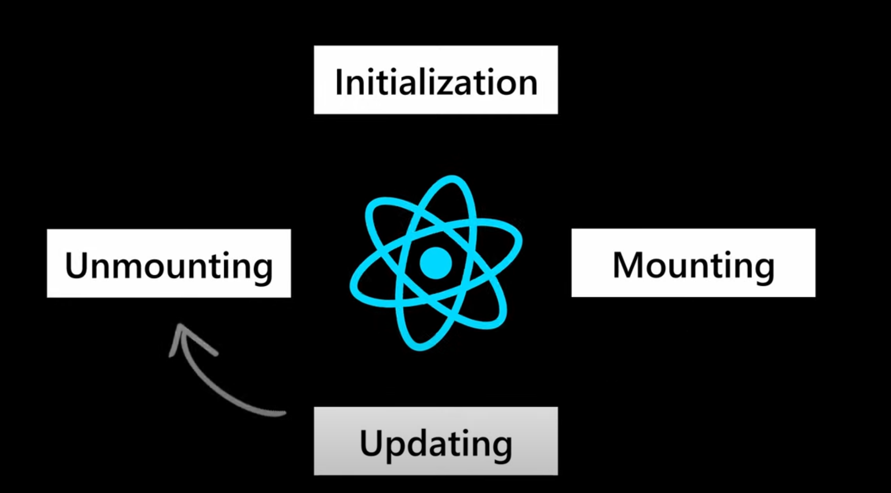

# Revite React Typescript Exercise
[TOC]

Test run the latest Typescript react, Storybook, And PlayWright other framework. Starting with a new way to instantiate a Typescript react application.

```bash
npm create vite@latest
or 
npm create vite@latest revite-exercise -- --template vanilla-ts
```

- This command creates a new [Vite](https://vitejs.dev/guide/) project named `my-vite-project` using the *TypeScript* template.

- Move the code out of the folder into the root of the git repository

  ```bash
  yarn install 
  # or 
  npm install
  npm run dev
  ```

  

- **ESLint Setup:** For code quality and linting, you might want to set up ESLint with TypeScript support.

  ```bash
  yarn add --dev eslint @typescript-eslint/parser @typescript-eslint/eslint-plugin
  ```

- **Prettier Setup:** For code formatting, set up Prettier.

  ```bash
  yarn add --dev prettier eslint-config-prettier eslint-plugin-prettier
  ```

- Update your `.eslintrc.cjs` to include Prettier configuration:

  ```js
  module.exports = {
      parser: '@typescript-eslint/parser',
      extends: [
          'eslint:recommended',
          'plugin:@typescript-eslint/recommended',
          'prettier',
          'plugin:prettier/recommended'
      ],
      rules: {
          // Customize your rules
      }
  };
  
  ```

- Create a `.prettierrc` file to customize Prettier settings:

  ```js
  {
      "singleQuote": true,
      "semi": false
  }
  ```

- Configure react: 

  ```bash
  yarn add --dev @types/react @types/react-dom @typescript-eslint/eslint-plugin @typescript-eslint/parser @vitejs/plugin-react typescript 
  ```

- Updated example to see for a working base can be found [here](https://stackblitz.com/edit/vitejs-vite-jrsfbb?file=package.json&terminal=dev)


## Testing with Jest

**Test-Driven Development** (TDD) is a software development approach that involves writing tests before writing the actual code. This methodology offers several advantages, which can significantly enhance the quality and maintainability of software. By prioritising testing and design upfront, TDD helps developers produce better code, reduce defects, and maintain a high level of productivity. Adopting TDD can lead to significant long-term benefits, making it a valuable practice for any development team.

### Step-by-Step Guide

- **Install Jest and Related Packages:** Open your terminal in the project directory and run the following command to install Jest, along with TypeScript support and other necessary packages: `yarn add --dev jest @types/jest ts-jest`

- **Configure Jest:** Create a `jest.config.js` file in the root of your project with the following content:

  ```javascript
  module.exports = {
      preset: 'ts-jest',
      testEnvironment: 'node',
      moduleFileExtensions: ['ts', 'tsx', 'js', 'jsx', 'json', 'node'],
      transform: {
          '^.+\\.tsx?$': 'ts-jest',
      },
      testMatch: ['**/*.test.ts'],
  };
  
  ```

- Optional: Configure ESLint for Jest

  - To ensure ESLint recognizes your Jest globals (like `test` and `expect`), add the Jest plugin and configure it:

  - **Install ESLint Jest Plugin:** `yarn add --dev eslint-plugin-jest`

  - **Configuration File (`jest.config.cjs` or `jest.config.mjs`):** Ensure your Jest configuration matches the following:

    - For `jest.config.mjs`  (ES Module):

      ```javascript
      export default {
        preset: 'ts-jest',
        testEnvironment: 'node',
        moduleFileExtensions: ['ts', 'tsx', 'js', 'jsx', 'json', 'node'],
        transform: {
          '^.+\\.tsx?$': 'ts-jest',
        },
        testMatch: ['**/*.test.ts'],
      }
      ```
    
  - **Add or Update `esModuleInterop`:** Add the `esModuleInterop` option and set it to `true`.

    


## Storybook

Storybook is a frontend workshop for building UI components and pages in isolation. Thousands of teams use it for UI development, testing, and documentation. It's open source and free. Learn more about it at https://storybook.js.org/

```bash
npx storybook@latest init
```

Add visual testing to this using Chromatic for visual testing.

```bash
yarn add --dev chromatic
npx chromatic --project-token=chpt_a4940aa96fc3a77
```

## Learn react in 10 minutes

This video will be a quick start summarise the basics [here](https://www.youtube.com/watch?v=s2skans2dP4). If you need more then jump to [1 hour more](https://www.youtube.com/watch?v=SqcY0GlETPk).




## React Testing Library

Learn all about [react testing library](https://testing-library.com/docs/react-testing-library/intro). Watch a video on this [here](https://www.youtube.com/watch?v=JKOwJUM4_RM). 

- Firstly, I structure the tests to be **readable** from the *describe* to the test always repeating the what this should be doing before adding the test
- Secondly, I always test what the **user can see** and the behaviour, favouring *accessibility* and *simplicity* of testing. You should never have complicated selectors, always favour text, semantic html which translates to roles and otherbasic formats around getting to to the component. 
- The real world is a lot more complicated and so you have a [cheat sheet](https://testing-library.com/docs/react-testing-library/cheatsheet) which can help you to create a [priority](https://testing-library.com/docs/queries/about#priority) order for how I get at content I am testing, based on the guiding principles. In summary this **Queries Accessible to Everyone**, then by **Semantic Queries** HTML5 and ARIA. Data dash or test id's should be a no go scenario where you have such a complicated scenario.
- Unit tests are meant to test one single unit, so **mock other components** being added and test the single unit only. Use Storybook as your scenario driven mechanism and business mechanism for why this should exist and visually test and verify what you are building.

	

- 

	

## Final Thoughts

This guide provides a comprehensive setup for initializing a Vite TypeScript project with optional ESLint and Prettier configurations. Vite's speed and simplicity, combined with TypeScript's type safety, offer an excellent development experience.
